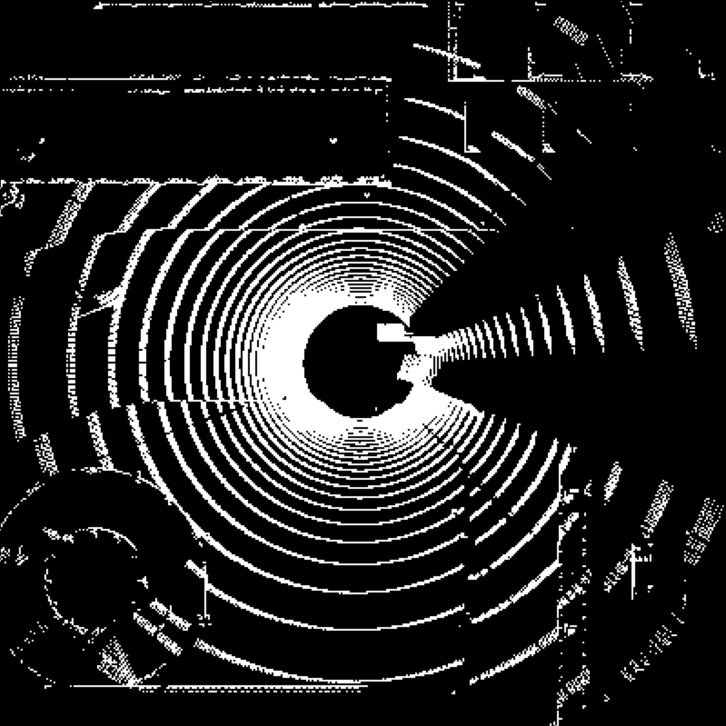
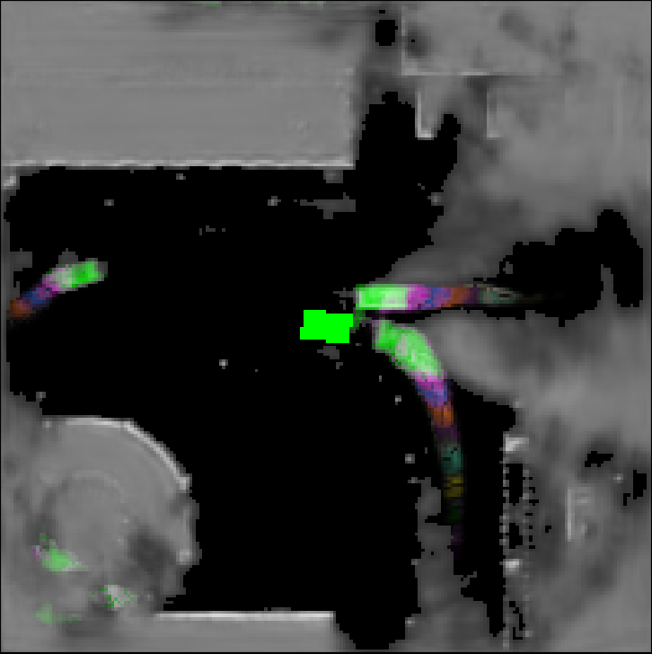

# Flow

## Using a Convolutional Neural Net to predict future positions

The code in this repository is working example of a CNN trained to predict the future motion of other vehicles based on 1 second of LIDAR input data.  The backbone neural net is based on the work of [Casas et al.](http://openaccess.thecvf.com/content/CVPR2021/html/Casas_MP3_A_Unified_Model_To_Map_Perceive_Predict_and_Plan_CVPR_2021_paper.html)[^1]

The models were developed and tested in the [Carla](https://carla.org/) Simulation environment.  In the following scene

  

the autonomous car has received the past second of LIDAR information about its surroundings. 

  

That input is passed to the trained neural network resulting the the following visuallization of the nearby environment.

  

Note that this image represents an overlay of the predicted static environment and the next 5 seconds of dynamic motion.  The different colour bands indicate the likely dynamic positions of the other vehicles.  The green rectangle in the centre represents the ego vehicle and is added as a visual aid.  It is not present in the network prediction output.

The methods to generate the dataset from LIDAR sensors are not currently included.

[^1]:Casas, Sergio, Abbas Sadat, and Raquel Urtasun. "Mp3: A unified model to map, perceive, predict and plan." Proceedings of the IEEE/CVF Conference on Computer Vision and Pattern Recognition. 2021.
